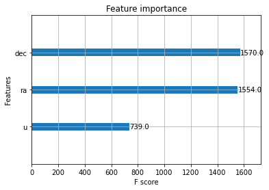
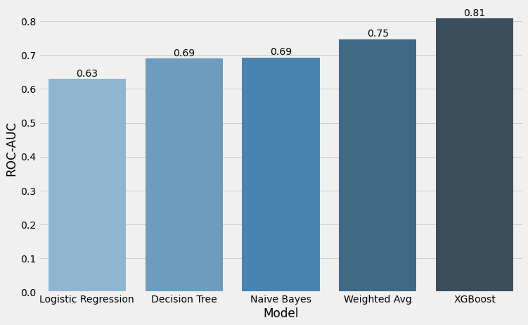

# Inverse-Covariance-Weighted-Averages-for-Astronomical-Discovery
Using advanced weighted averaging ensemble strategies for increasing classification accuracy

<figure>

<figcaption align = "center"><b> The utilized dataset was collected by the Sloan Digital Sky Survey (SDSS) pictured here. The SDSS is a multi-spectral imaging and spectroscopic redshift survey in operation since 2000. The SDSS uses a 2.5m wide-angle optical telescope located at Apache Point Observatory in New Mexico in the United States. </b></figcaption>
</figure>

     

Dataset reference is https://www.kaggle.com/datasets/muhakabartay/sloan-digital-sky-survey-dr16

In this study we use a machine learning ensembling strategy based on weighting model contributions inversely to the model covariances. The aim of averaging machine learning models
together is the cancel erroses. We adopt a strategy of averaging based on the unique variance of each model. 
This strategy facilitates the assignment of model weight preferentially towards predictions that are less correlated and so more diverse, minimizing the variance of the predictions.

We use this strategy to identify stars or galaxies in data collected by the SDSS using just a few features from the data.

* dec = J2000 declination (r-band)
* ra = J2000 right ascension (r-band)
* u = better of dev/Exp magnitude fit (u-band)

We plot the feature importance given by XGBoost, utilizing the weight metric for feature importance which quantifies the number of times a feature is used in a tree in the ensemble.

<figure>

<figcaption align = "center"><b> Star and galaxy data classes in the SDSS DR16 dataset. </b></figcaption>
</figure>

We visualize the performance of the models according to the area under the curve (ROC-AUC) metric.

<figure>

</figure>

<figure>

</figure>

We see that while the inverse-covariance weighted average ensembling strategy does improve over the performacne of the 3 models alone, the ensembling and normalization strategies incorporated in XGBoost prove to provide superior performance overall.
